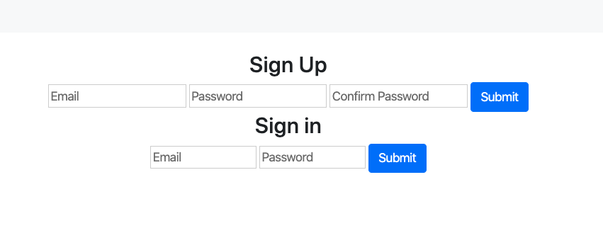
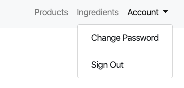
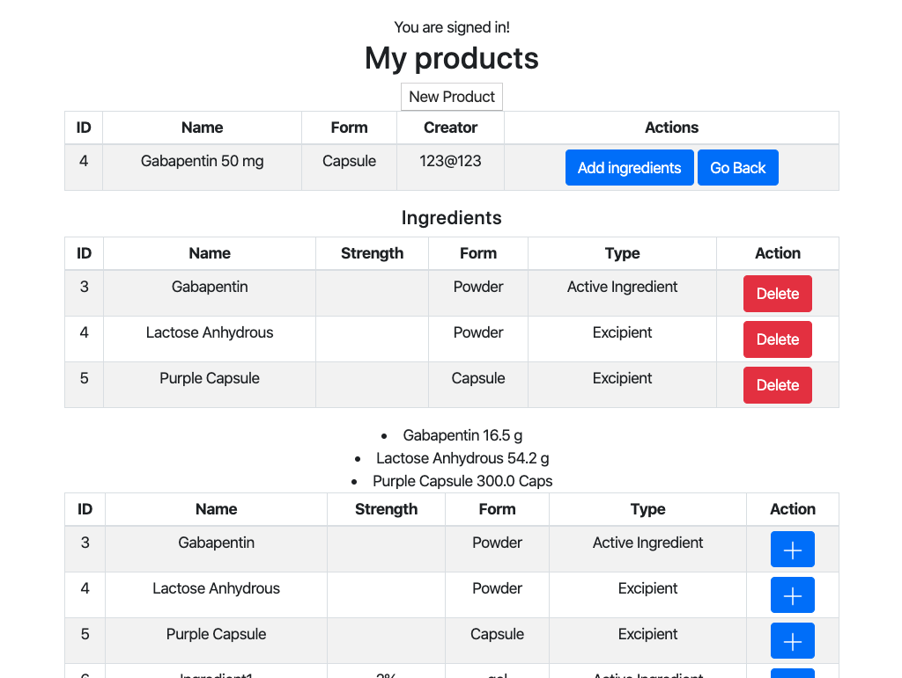
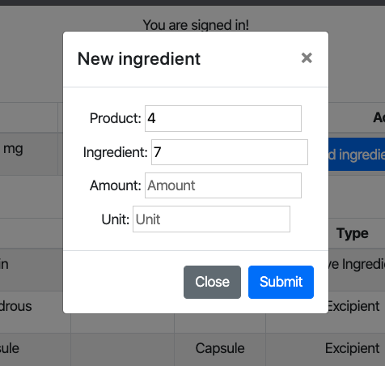
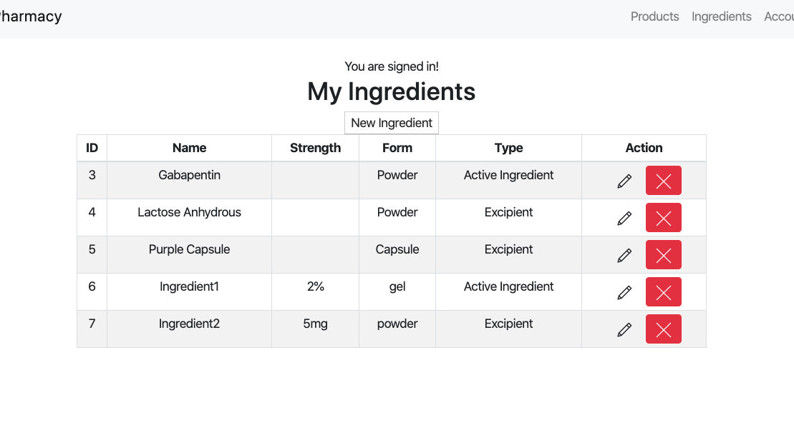
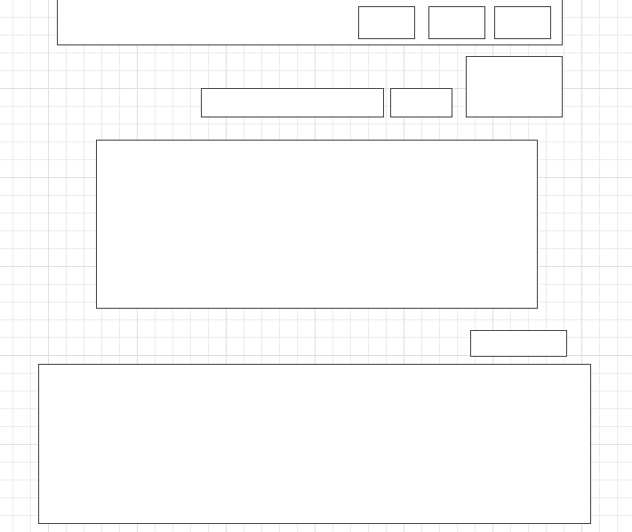

# CompoundingTracker

##### Authorization

<!--  -->
##### Product detail, and add ingredient page

##### Creating join table

##### Ingredient list

### Deployed sites
* [Deployed Client](https://wyang19a.github.io/pharmacy-client/)
* [API Repo](https://github.com/wyang19a/pharmacy-api)
* [Deployed API](https://safe-brushlands-23264.herokuapp.com/)

### User stories
- User should be able to sign up, sign in, sign out, change password.
- User should be able to see all, or one `product`.
  - User should be able to see product with detailed ingredient list for the `product`.
- User should be able to create a new `product`.
- User should be able to edit, delete a `product`.
- User should be able to see all, or one `ingredient`.
- User should be able to create a new `ingredient`.
- User should be able to edit, delete an `ingredient`.
- User should be able to make a new `recipe` with created `product` and `ingredient`.
- User should be able to see `recipes` when user requests `product` details.
- User should be able to edit, delete a `recipe`.

### Wireframeru

### Technologies used
- HTML
- CSS
- Bootstrap
- Javascript
- Ajax
- JQuery

### TODOS
- Recipe `UPDATE` and `DELETE` refreshes the list.
- Fix bootstrap modal not closing on submit.
- Prepopulate all edit fields, not just for recipe.
- Make forms appear/disappear as needed.

### Thoughts
It was challenging for me to implement all the CRUD routes properly between three resources I had, but it was a great practice designing my own RESTful API and connecting it to frontend. I had lots of struggle and small successes while working on this project.
